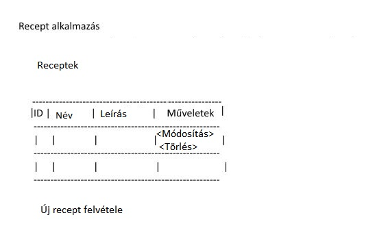

## Követelményanalízis

1. Követelmények összegyűjtése
	1. Funkcionális elvárások
		- Szeretnék felvinni egy étel elkészítési útmutatóját, ill. azt módsítani/ törölni --> Recept felvitele/ módosítása törlése
		- Saját receptbe a hozzávalókat is bele szeretném rögzíteni, ill. azokat módostani törölni --> Hozzávalók rögzítése/ módosítása/ törlése
		- Meg szeretném tekinteni saját receptjeimet --> Recept megtekintése
	2. Nem funkcionális követelmények
		- Felhasználóbarát, ergonomikus elrendezés és kinézet.
		- Gyors működés.
		- Biztonságos működés: jelszavak tárolása, funkciókhoz való hozzáférés.
2. Szakterületi fogalomjegyzék
	- ingredient: hozzávaló angolul
	- recipe: recept angolul
3. Használatieset-modell
	1. Szerepkörök
		- vendég('guest'): a nyitóoldal tartalmához fér hozzá, mást nem tud
		- normál felhasználó('normal'): a vendég szerepkörén túl tud saját recepteket megtekinteni, feltölteni, módosítani, törölni, ill. azokhoz hozzávalókat hozzáadni, mdosítani, törölni
		- operátor('operator'): a normál felhasználó szerepkörén túl bármely felhasználó receptjét kezelheti, továbbá láthatja a felhasználók adatait, vmint törölhet is felhasználókat
	2. Használati eset diagramok

		

	3. Folyamatok pontos menete

		

## Tervezés

1. Architektúra terv
	1. Komponensdiagram
	2. Oldaltérkép

		

	3. Végpontok
		- Nyitólap: `/`
		- Receptek listázása: `/recipes/list`
		- Recept megjelenítése: `/recipes/describe/:id`
		- Hozzávaló hozzáadása: `/ingredients/new/:recipe_id`
		- Hozzávaló módosítása: `/ingredients/modify/:id`
		- Hozzávaló törlése: recept megjelenítésénél belső js controller függvény
		- Recept módosítása: `/recipes/modify/:id`
		- Recept törlése: recept listázásánál belső js controller függvény
		- Új recept felvétele: `/recipes/new`
2. Felhasználóifelület-modell
	1. Oldalvázlatok
	
		

3. Osztálymodell
	1. Adatmodell

		

	2. Adatbázisterv

		

	3. Állapotdiagram

## Implementáció

1. Fejlesztői környezet bemutatása
	- A fejlesztéshez a Cloud9 webes felületét használtam, amely egy virtuális linux-alapú felületet biztosít annak minden hasznos eszközével (bash, fájlböngésző, színkiemeléses szövegszerkesztő), szerver tesztelésére saját ideiglenes domaint kínál, valamint fájlok feltöltésére  is lehetőséget ad. Többféle programozási nyelvet is támogat.
2. Könyvtárstruktúrában lévő mappák funkiójának bemutatása
	- A forrásfájlokat a következők szerint csoportosítottam
		- Model - View (itt: handlebars) - Controller - struktúra (`models/ - views/ - controllers/`)
		- `public/` könyvtár: statikus segédelemek (jelen esetben: Bootswatch css)
		- `config/` könyvtár: waterline tárolási beállítások
		- `test/` könyvtár: tesztelő szkriptek
		- `node_modules/` könyvtár: node.js segédmodulok

##Tesztelés

1. Tesztelési környezet bemutatása

2. Egységtesztek

3. Funkcionális felületi tesztek

4. Tesztesetek
	- felületi tesztelés:
		- nyitólap meglátogatása
		- új recept készítése
		- új hozzávaló hozzáadása az előbbi példában készített recepthez

##Felhasználói dökumentáció

1. A futtatáshoz ajánlott hardver-, szoftver konfiguráció
	A futtatáshoz minimum 2GHz-es egymagos processzor, legalább 512 MB RAM és 1GB szabad tárhely ajánlott. A program használatához valamilyen Linux operációs rendszer disztribúció szükséges.
2. Telepítés lépései és a program használata
	A fájlokat a GitHub `Download Zip` opciója segítségével lehet letölteni ezután a saját szerverre kicsomagolással felrakható, majd a REST szerver a server.js futtatásával elindítható, mig az Ember.js kliens-oldali alkalmazás szervere az `ember server` parancs kiadásával indítható. Az esetleges függőségeket (dependency) a `npm install <fuggoseg> --save` paranccsal telepíthetjük.
